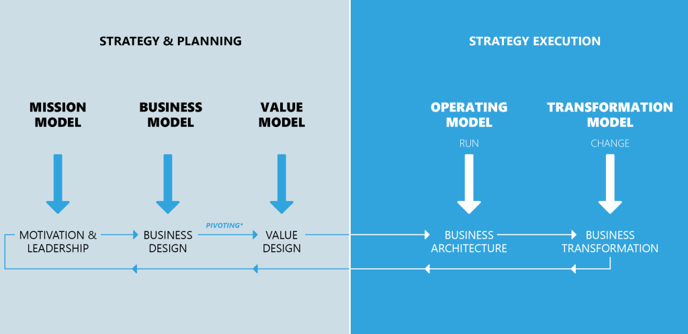
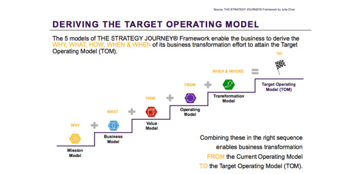
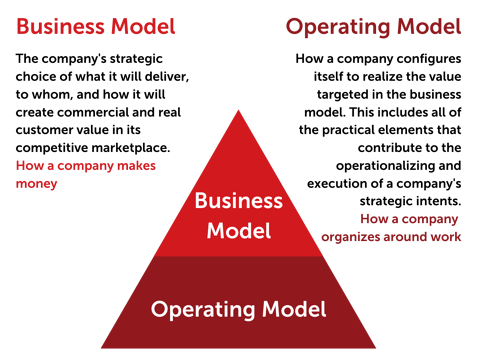
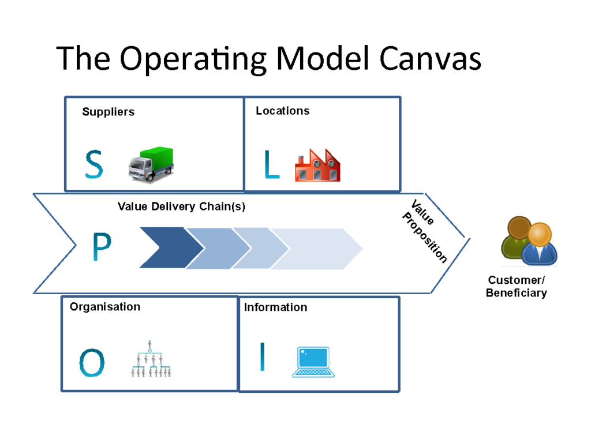

```{r setup, include=FALSE}
knitr::opts_chunk$set(echo = TRUE, message=FALSE, warning=FALSE,
                      comment="", digits = 3, tidy = FALSE, prompt = FALSE, fig.align = 'center')
library(tidyverse)
library(rvest)
library(lubridate)
```


<iframe width="560" height="315" src="https://www.youtube.com/embed/O5242n_W9vA" title="YouTube video player" frameborder="0" allow="accelerometer; autoplay; clipboard-write; encrypted-media; gyroscope; picture-in-picture" allowfullscreen></iframe>

# Competing in the age of AI [@iansiti2020competing] {#ai-competition}

# Building Blocks {#builing-blocks}





- [How to design a “Target Operating Model” that delivers tangible outcomes](https://www.casseo.com/how-to-design-a-target-operating-model-that-delivers-tangible-outcomes/)




- [When You Should Design a New Target Operating Model](https://blog.on-the-mark.com/blog/when-to-design-target-operating-model)



- [Will This Replace The Business Model Canvas?](https://lionessmagazine.com/will-this-replace-the-business-model-canvas/)


