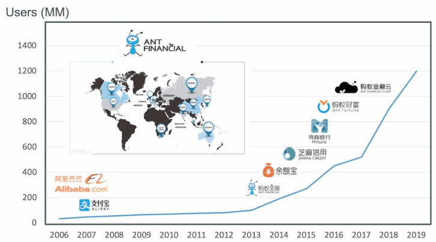
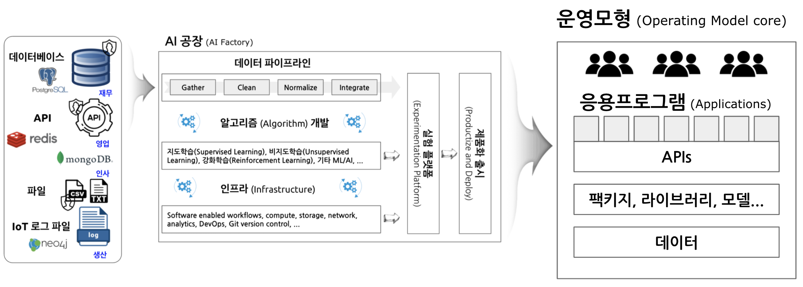
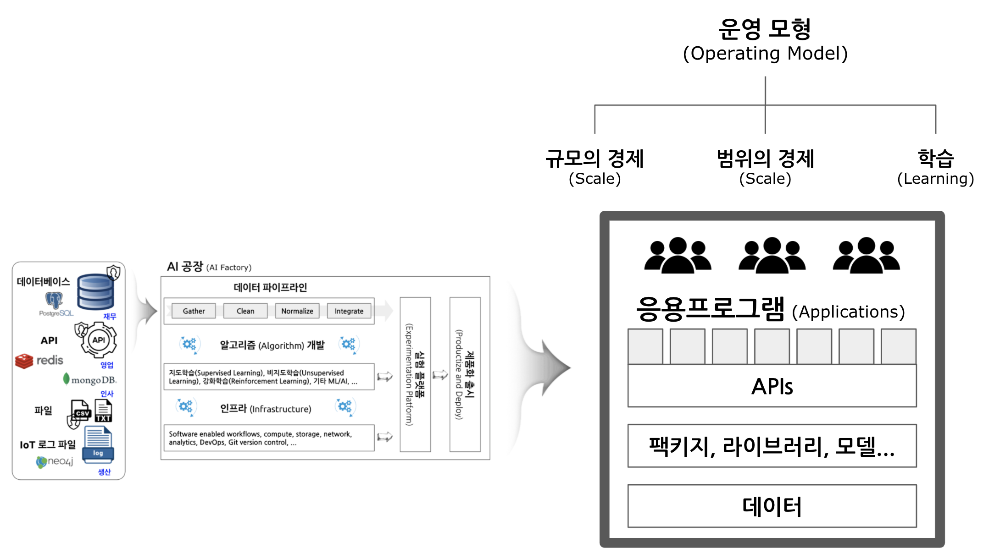
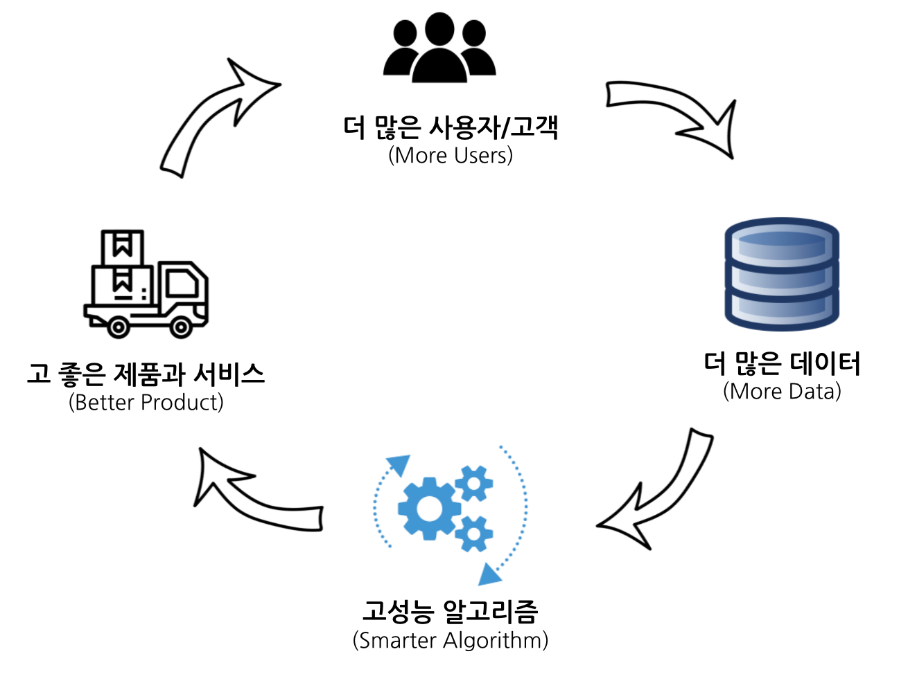

```{r setup, include=FALSE}
knitr::opts_chunk$set(echo = TRUE, message=FALSE, warning=FALSE,
                      comment="", digits = 3, tidy = FALSE, prompt = FALSE, fig.align = 'center')
library(tidyverse)
library(rvest)
library(lubridate)
```

<iframe width="560" height="315" src="https://www.youtube.com/embed/O5242n_W9vA" title="YouTube video player" frameborder="0" allow="accelerometer; autoplay; clipboard-write; encrypted-media; gyroscope; picture-in-picture" allowfullscreen>

</iframe>

# Competing in the age of AI [@iansiti2020competing] {#ai-competition}

# Building Blocks {#builing-blocks}


-   [How to design a "Target Operating Model" that delivers tangible outcomes](https://www.casseo.com/how-to-design-a-target-operating-model-that-delivers-tangible-outcomes/)


-   [When You Should Design a New Target Operating Model](https://blog.on-the-mark.com/blog/when-to-design-target-operating-model)


-   [Will This Replace The Business Model Canvas?](https://lionessmagazine.com/will-this-replace-the-business-model-canvas/)

# 강 AI 와 약 AI {#strong-ai-vs-week-ai}

> -   **Strong AI**: "Machine that can think and act in a way that matches or surpasses human intelligence"
> -   **Weak AI**: "Any activity computers are able to perform that humans once performed.
>
> Nils J. Nilsson, 2010; Standford AI 100 report, 2016.

# Ant Financial Story {#ant-financial}

Data, AI, Digital Network를 사용해서 회사의 본질(Nature of Firm)을 바꿈.



# 사업 모형과 운영 모형 {#bm-vs-om}


## AI 공장 {#ai-factory}


## AI 운영 모형 {#ai-factory-operating-model}

AI 공장(Factory)는 데이터를 끊임없이 입고 받아 이를 AI 알고리즘을 생산하고 현업에서 사용할 수 있는 형태로 가공하여 회사의 운영 핵심(core)으로 자리매김하여 가치를 창출한다.



## 전통 운영 모형 {#traditional-model}


## AI 기업 운영 모형 {#ai-operations-model}



## 전통 기업 가치 {#traditional-value-of-the-firm}


## AI 가치 {#value-ai}


## 네트워크 효과 {#network-effect}



## 네트워크 효과와 디지털 {#network=effect-digital}


# 충돌 {#digital-collision}


## 사업영역 충돌 {#digital-collision-business}


