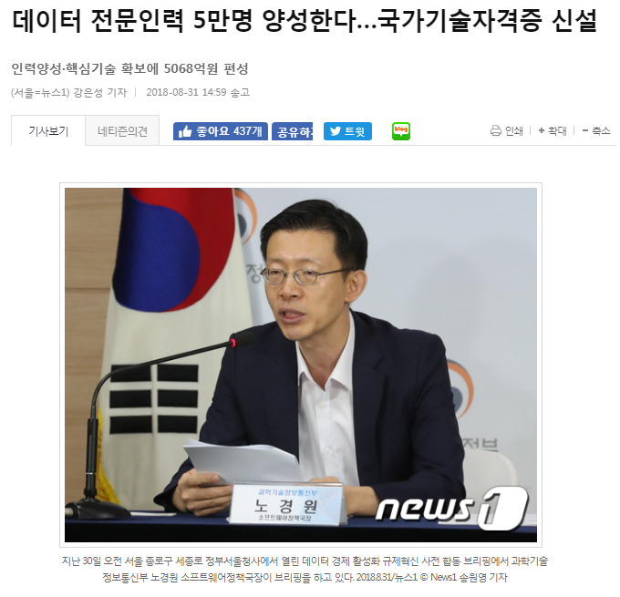

## 강의 개요

- 강사소개: [데이터 과학자 이광춘](https://datayanolja.github.io/2017-datayanolja/program-2017.html#kwangchunlee)
- 강의 목차
    - 기계학습(머신러닝)의 원자재인 데이터
    - 데이터과학과 머신러닝의 차이점
    - 기계러닝의 기본 구성요소(데이터, 프로그래밍, 알고리즘)
    - **기계학습 자동화와 API**
    - 데이터과학과 머신러닝 응용의 실제 사례

# 데이터 과학 사고

- 가치(Value) 원천
- 사고체계의 진화
- 4번째 패러다임

## 

> 기계와 더불어 사는 한국인; 기계와의 경쟁...
> 
> **xwMOOC**

## 가치(Value) 원천

세계은행(World Bank)과 한국개발연구원(KDI)은 약 2년여 기간의 공동연구를 통해 1960-2005 년간 한국 경제발전 과정에 관한 보고서를 출간했다. 경제성장이 지속되기 위해서는 생산성 증가가 대단히 중요하고, 1960년 이후 한국경제의 성공은 광의의 지식축적에 기인한 것으로 1960-2005년 사이 한국의 실질 1인당GDP의 75%가 광의의 지식축적에 기인한 것으로 분석했다.

## 사고체계의 진화

- 수학적 사고(Mathematical Thinking)
- 통계적 사고(Experimental Thinking) 
- 컴퓨팅 사고(Computational Thinking)

[Wing, Jeannette M. "Computational thinking." Communications of the ACM 49.3 (2006): 33-35.](http://research-srv.microsoft.com/en-us/um/redmond/events/asiafacsum2012/day1/Jeannette_Wing.pdf)

### 4번째 패러다임

## 수직적 시장 &rarr; 인공지능 시장

 

- 수직적(Vertical) 시장 &rarr; 플랫폼(Platform) 시장 &rarr; 인공지능(AI) 마켓으로

## xwMOOC 오픈 컴퓨터

<iframe width="560" height="315" src="https://www.youtube.com/embed/PcXLYOMnhd0" frameborder="0" allowfullscreen></iframe>

## 자동차 클러스터 사례

## 산업역군(?)

<iframe width="560" height="315" src="https://www.youtube.com/embed/t346si4gy_M" frameborder="0" allowfullscreen></iframe>

[MATT RICHTEL, "Reading, Writing, Arithmetic, and Lately, Coding"", The New York Time,  MAY 10, 2014](http://www.nytimes.com/2014/05/11/us/reading-writing-arithmetic-and-lately-coding.html)

## 데이터 과학과 통계적 사고

|        통계적 사고                 |        데이터          |
|:-----------------------------------|------------------------|
|통계는 과거 통계 팩키지(SAS, SPSS, 미니탭 등)에 데이터를 넣어 돌리고 결과를 해석하는 학문으로 쉽게 생각하기도 한다. 수학적인 면에서 보면, 인문학도가 보면 어려운 수학이지만 수학을 전통으로 하는 분들이 보면 쉽게 보이는 것도 사실이다. 하지만, 통계는 데이터에 기반해서 **귀납적 사고방식을 확률로 표현**하는 어찌보면 쟈넷윙 박사가 정의한 컴퓨팅 사고(Computational Thinking) 에 따르면 수학적 사고(Mathematical Thinking) 와 더불어 인간 사고체계의 큰 기둥을 이루고 있는 실험적 사고(Experimental Thinking) 체계다. | <http://statkclee.github.io/data-science/ds-webdata.html> |

 

- [LG인화원(2018-06-22)](https://statkclee.github.io/ds-authoring/LG인화원_20180622.html)

## 데이터 전문인력 5만명 양성

["데이터 전문인력 5만명 양성한다...국가기술자격증 신설 - 인력양성·핵심기술 확보에 5068억원 편성 (서울=뉴스1) 강은성 기자 | 2018-08-31 14:59 송고](http://news1.kr/articles/?3413828)

# 기계학습 자동화와 API

## 

1. 강인한 회귀모형
1. 기계학습 자동화
1. 기계학습 모형 이해와 해석 
1. 기계학습 모형 배포 

> "The future is here, it's just not evenly distributed yet.“
> 
> **William Gibson**

## 강인한 회귀모형 시각화

[xwMOOC 모형: 회귀모형 - `purrr` + `trelliscopejs`](https://statkclee.github.io/model/model_purrr_trelliscopejs.html)

## 기계학습 자동화

[데이터 과학: 기초 통계 - 통계 모형(Statistical models)](https://statkclee.github.io/statistics/stat-modeling.html)

[xwMOOC 모형: 기계학습 모형개발 30분 - recipe + $H_2 O$ AutoML](https://statkclee.github.io/model/model-recipe-h2o-automl.html)

## 기계학습 모형 이해와 해석

[xwMOOC 모형- 모형 이해와 설명](https://statkclee.github.io/model/model-explain.html)

## 기계학습 모형 배포

[R 병렬 프로그래밍: 배포(deployment) = 기계학습 모형 사용](https://statkclee.github.io/parallel-r/r-restful-production.html)

## 데이터도 API

- [데이터 과학: 기초 통계 - kosis와 tidycensus 비교](https://statkclee.github.io/statistics/tidycensus-kosis-comparison.html)
- [xwMOOC 데이터 시각화: 국회의원 사진 - trelliscope](https://statkclee.github.io/viz/viz-congressman.html)
- [xwMOOC 데이터 제품 - 슈퍼영웅(Super Heores)](https://statkclee.github.io/data-product/dp-superhero.html)
- [`ingest-data`: 다양한 데이터 가져오기](https://statkclee.github.io/ingest-data/)
- 그럼 소프트웨어 API, 더 나아가 인공지능 API

# 한걸음 더 들어갑니다.

##

> “AI is a superpower!!!”, 인공지능을 체득하면 슈퍼파워를 손에 쥘 것이다.
> 
> **Andrew Ng**

## 사람이 이해하는 감정

## 인공지능이 바라본 감정

[A computer watched the debates. It thought Clinton was happy and Trump was angry and quite sad](http://qz.com/810092/a-computer-watched-the-debates-and-thought-clinton-happy-trump-angry-sad/)

## 인공지능 개발 스펙트럼

## 인공지능 API

- 구글
    - 구글 클라우드비젼
        - 구글 클라우드 비젼 API
    - R 구글 애널리틱스(GA)
    - R 구글 url 축약-googleAuthR
- IBM 왓슨, TTS
- 마이크로소프트
    - 마이크로소프트, 얼굴 감정분석
    - 마이크로소프트, 텍스트 감성분석
- 아마존 알렉사, 라즈베리파이

[인공지능 API](https://statkclee.github.io/ai-lab/)

## 기계와의 전쟁

#### [디지털 경제와 작업장(Gold Farming)](https://statkclee.github.io/statistics/stat-gold-farming.html)
#### [작업장 탐지](https://statkclee.github.io/statistics/stat-gold-farming-detection.html)

